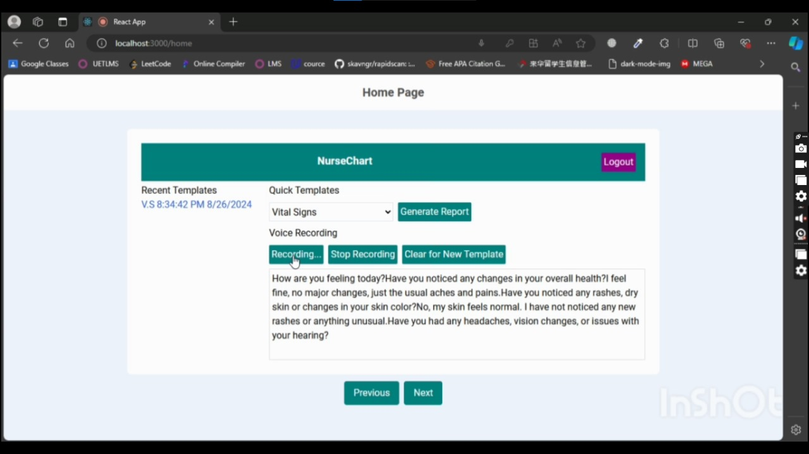

## Project Propsal
Below is the Project Proposal that was shared by University Of California Student Okafor Linda.

[Project Proposal](./Assets/AI-Assisted%20Documentation%20for%20Home%20Health%20and%20Hospice%20Nurses.pdf)

## Project Ui Design
Below is the Project Ui design shared by Okafor Linda.

[Project Ui Design](./Assets/AI%20Prototype%20-%20Okafor%201.pdf)

## Templates Information
Templates information was shared by Okafor Linda. Extracted information from the nurse-patient conservation is according to these templates.

[Templates Information Report](./Assets/Template%20information.pdf)

## NurseChart Project Presentation
Below is the presentation slides for the project covering problem statement, technology used, demo etc.

[NurseChart Project Presentation](https://docs.google.com/presentation/d/12W_DbmTHXiS1UQhYwLEHEnNpQ2KBwTgl3TNaMWVIW0c/edit?usp=sharing)

## NurseChart Project Report
Below is the Technical Report of the project covering introduction, flow details, tools used etc.

[NurseChart Project Report](https://docs.google.com/document/d/1_ccPt-3UcWiqGwX4-tUxtHN_Cy0LBsyDkeeaQCHiMr4/edit?usp=sharing)

## Recorded Demo
Below is the recorded demo of the NurseChart application with voice over. Clikc the below link to watch the demo video.

## Flow diagram with Recorded Explanation
Below is the flow diagram of the NurseChart appliation. Click the image to see the recorded video for the flowchart explaination.

